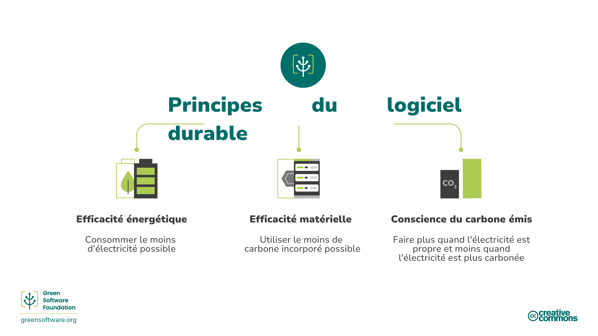
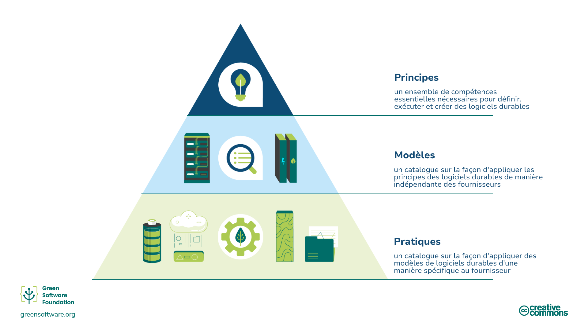

:::note
Il s’agit d’une traduction fournie par la communauté. Le support est limité et pourrait ne pas correspondre à la toute dernière version en anglais.
:::

## Qu’est-ce qu’un logiciel durable?

Le logiciel durable est une discipline émergente à l’intersection de la science du climat, de la conception de logiciels, des marchés de l’électricité, du matériel et de la conception de centres de données.

Le logiciel durable est un logiciel efficace en carbone, ce qui signifie qu’il émet le moins de carbone possible. Seules trois activités réduisent les émissions de carbone des logiciels: l’efficacité énergétique, la conscience du carbone émis et l’efficacité du matériel. Cette formation expliquera tous ces concepts, comment les appliquer à vos processus et comment les mesurer, ainsi que certaines des directives internationales et les organisations qui guident et surveillent ce domaine.

## A qui s'adresse cette formation?

A toute personne impliquée dans le processus de création, de déploiement ou de gestion de logiciels. En étudiant ces principes, un professionnel du logiciel durable peut prendre des décisions qui ont un impact significatif sur la pollution par le carbone de leurs applications.

## Histoire

En 2019, la version originale des huit principes de l'ingénierie logicielle durable a été publiée. Cette mise à jour des principes datant de 2022 a pris en compte les commentaires reçus au fil des ans, fusionnant certains principes et en ajoutant un nouveau concernant la compréhension des engagements en faveur du climat.

## Comment être un professionnel du logiciel durable?

La formation suivante couvre six domaines clés qu’un professionnel du logiciel durable devrait connaître:

1. **Efficacité en carbone**: Émettre le moins de carbone possible.
2. **Efficacité énergétique**: Utiliser le moins d’énergie possible.
3. **Conscience du carbone émis**: Faire plus lorsque l’électricité est plus propre et faire moins lorsque l’électricité est plus carbonée.
4. **Efficacité du matériel**: Utiliser le moins de carbone incorporé possible.
5. **Mesure**: Ce que vous ne pouvez pas mesurer, vous ne pouvez pas l’améliorer.
6. **Engagements en faveur du climat**: Comprendre le mécanisme exact de réduction du carbone.

Chacun de ces chapitres présentera de nouveaux concepts et expliquera en détail pourquoi ils sont importants en termes de climat, et comment vous pouvez les appliquer à vos pratiques de logiciel durable.

## Principes, modèles et pratiques.

Les principaux domaines et le contenu de ce cours décrivent les **principes** du logiciel durable, un ensemble de compétences de base nécessaires pour définir, exécuter et créer un logiciel durable.

Un [**modèle**](https://patterns.greensoftware.foundation/) de logiciel durable est un exemple précis de la façon d’appliquer un ou plusieurs principes dans un cas réel. Alors que les principes décrivent la théorie qui sous-tend le logiciel durable, les modèles sont les conseils pratiques que les professionnels du logiciel peuvent utiliser dans leurs applications logicielles aujourd’hui. Les modèles sont indépendants des fournisseurs.

Une **pratique** de logiciel durable est un modèle appliqué à un produit spécifique d’un fournisseur et informe les professionnels sur la façon d’utiliser ce produit de manière plus durable.

Les pratiques devraient faire référence à des modèles qui eux-mêmes devraient faire référence à des principes.

La Green Software Foundation publie également un [catalogue de modèles de logiciels durables neutres pour les fournisseurs](https://patterns.greensoftware.foundation/) dans diverses catégories.
 

